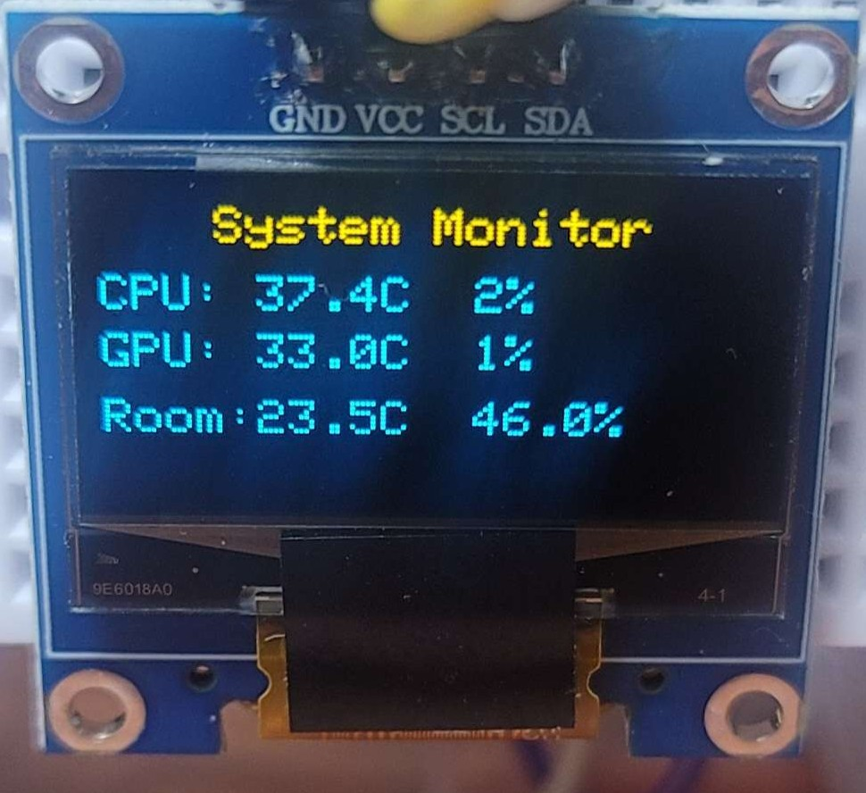

# Arduino Monitoring System with Python + Serial + OLED

이 프로젝트는 PC의 CPU, GPU 사용률 및 온도 데이터를 Python으로 수집하고, 시리얼 통신을 통해 Arduino로 전송하여 OLED 디스플레이에 출력하는 시스템입니다.



## 프로젝트 파일 구성


## 사용 기술 및 라이브러리

### Arduino
- **Adafruit_SSD1306**, **Adafruit_GFX**: OLED 출력
- **DHT**: 온습도 센서 (옵션)

### Python
- `psutil`: CPU 및 메모리 정보 수집
- `GPUtil`: GPU 정보 수집
- `pyserial`: 시리얼 통신

---
## 장치 구성

**OLED (I2C 방식)**  
  - **VCC** → 5V  
  - **GND** → GND  
  - **SCL** → A5 
  - **SDA** → A4 

- **DHT11 센서 (옵션)**  
  - **VCC** → 5V  
  - **GND** → GND  
  - **Data** → D2 


## 실행 방법

### 1. Arduino 측

1. Arduino IDE 에서 `.ino` 파일 열기(아두이노의 COM포트와 파이썬 코드 내 COM포트 일치시키기)
2. OLED 및 센서 연결 후 업로드
   - DHT11 센서 포함 버전을 사용하려면 `arduino-monitor_with_DHT11.ino` 사용
3. 라이브러리 설치 필요
   - `Adafruit SSD1306`, `Adafruit GFX`, `DHT sensor library`
   
### 2. OpenHardwareMonitor 설치
https://openhardwaremonitor.org/downloads/ 다운 후
captur.png 와 같이 압축 해제 후 배치

### 3. Python 

```bash
pip install psutil GPUtil pyserial
python hwmonitor.py
```

### 3.1 Python 실행(windows)

monitor_start.bat 실행
